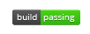

# **PROGRAMMER PORTFOLIO** 

## Check out the deployed app <a href="https://desmondaldridge.github.io/portfolio/">here!</a>

## <u>FEATURES</u>

#### My current website featuring my portfolio as well as a brief bio and contact information.

## <u>BEHIND THE SCENES</u>

#### This assignment was both geared towards guiding us along to career readiness/competitiveness, as well as allowing us to utilize and demonstrate what we've learned since the last time we were assigned to update our portfolio webpage.

 

## <u>REFLECTIONS</u>

#### I started a bit late on this, as I misunderstood this to be a career service milestone assignment. In large part due to not noticing the homework folder (and therefore a homework assignment) during the second and final project week. When I heard mention of the assignment from a fellow student over break, it still wasn't until the weekend before it was due that I actually learned that it was in fact a homework assignment and that was indeed a folder containing specific instructions.

#### Regardless of the last minute scramble, I did enjoy this one. I've learned that I need to be more vigilant in avoiding going down styling rabbit holes, especially on minutia, and to rely more on containers, grids, and or any other tools are available to make elements more innately responsive. I spent far too much time on little adjustments in terms of responsiveness, as well I needlessly addressed screen sizes that didn't need to be addressed.
